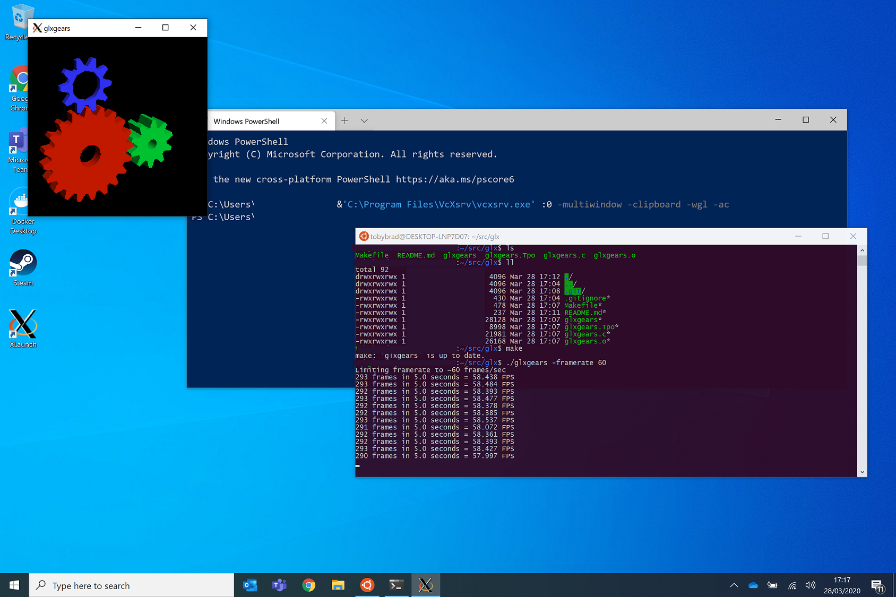

# glxgears
Framerate limited modification of glxgears




```
~/src/glxgeare$ make
~/src/glxgeare$ ./glxgears -framerate 60
Limiting framerate to ~60 frames/sec
294 frames in 5.0 seconds = 58.657 FPS
292 frames in 5.0 seconds = 58.394 FPS
```

tl;dr; If you're seeing very slow framerates running glxgears or similar against VcXsrv there's a 
chance the client is simply overwhelming the server with network traffic and the server simply buckles under
all of that load and never gets around to actually drawing anything. Limiting the rate at which the client 
requests frames from the server solves the issue.

Whilst setting WSL2 up to run graphics apps on my Windows 10 machine I ran into the issue described 
[here](https://superuser.com/questions/1487555/how-to-troubleshoot-opengl-on-ubuntu-under-windows-10-wsl). Running 
glxgears in my WSL2 environment /kinda/ worked but was really, really slow updating the display in the XServer
running in my Windows environment. Meanwhile gears was reporting crazy framerates of over 2000 fps on my machine.

Xming didn't have this problem, running at arounf 300 fps, but Xming also doesn't have hardware acceleration support
for openGL and I knew I was going to need that for the project I was starting.

So.. what's going on? What if glxgears really was reporting an accurate framerate.. at least from it's point of view of
having sent that many frames to the server (because modern displays aren't physically framerate limited in the way 
CRTs were) and what if the server spent all it's time dealing with the incoming traffic and forgot to do any rendering?

If we slow glxgears down, might the server have time to actually draw stuff.

Luckily glxgears is freely available and simple to modify.. so I added a basic framerate limiter option to the command
line switches and lo and behold.. stuff starts going fast.

Using VcXsrv on my Surface Book2 I see framerates of ~850 frames/sec (by passing -framerate 1000 and seeing what gets reported).. Doesn't seem to make much difference whether I 'export LIBGL_ALWAYS_INDIRECT=1' or start VcXsrv with or without the '-wgl' option, all combinations give pretty similar results for me.

So... there you have it.. if you're seeing slow frame rates with glxgears against VcXSrv, don't sweat it.. most other 
apps will probably work just fine and if they don't see if they have some option to limit their framerates to give 
the server time to actually draw something.

--
t o b e
